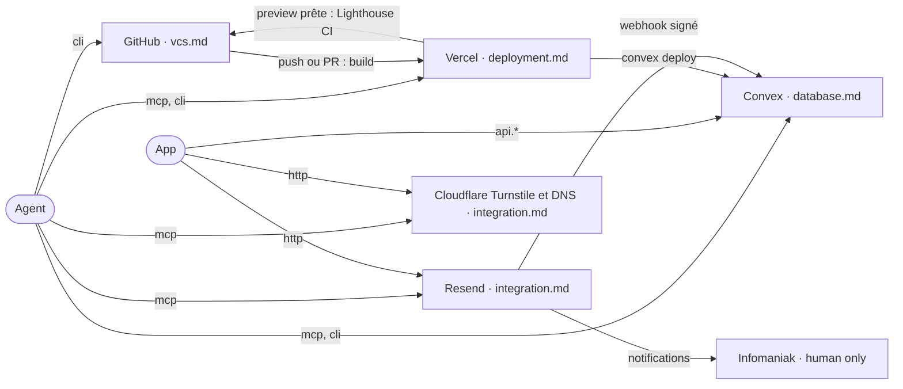

# Ecosystem

```mermaid
flowchart LR
  Agent([Agent])
  App([App])
  GitHub["GitHub · vcs.md"]
  Vercel["Vercel · deployment.md"]
  Convex["Convex · database.md"]
  Resend["Resend · integration.md"]
  Cloudflare["Cloudflare Turnstile et DNS · integration.md"]
  Infomaniak["Infomaniak · human only"]

  Agent -- cli --> GitHub
  Agent -- "mcp, cli" --> Vercel
  Agent -- "mcp, cli" --> Convex
  Agent -- mcp --> Resend
  Agent -- mcp --> Cloudflare
  App -- "api.*" --> Convex
  App -- http --> Resend
  App -- http --> Cloudflare

  GitHub -- "push ou PR : build" --> Vercel
  Vercel -- "preview prête : Lighthouse CI" --> GitHub
  Vercel -- "convex deploy" --> Convex
  Resend -- "webhook signé" --> Convex
  Resend -- notifications --> Infomaniak
```
